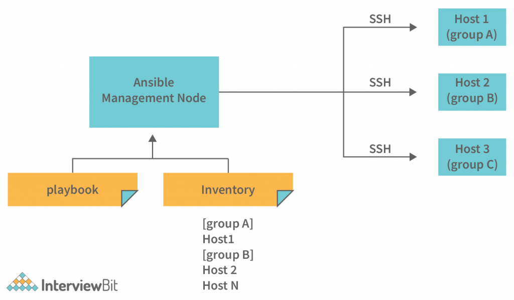

# Architecture

## What is Anible?
[Ansible](https://docs.ansible.com/ansible/latest/index.html) can configure any resource on a server through its idempotent playbooks and even run ad-hoc scripts. It takes complex or cumbersome manual tasks and orchestrates them by automating the process.
Tasks done wrong are typically repetitive in nature. Why? Because our brains get used to the process, get bored, and start making mistakes. Creating automation solutions using a programmable tool like Ansible takes away repetitive manual tasks. The manual task becomes code that is stored in source control, so others can review the work that will be done as well.
Many configuration management tools exist from Chef, Puppet, Salt, CFEngine, and so on. What makes Ansible so different? The answer is simplicity. Tools like Chef and Puppet use actual programming languages to write automation instructions like Ruby.
__Ansible, on the other hand, doesn’t use a programming language but a much simpler markup language called YAML__. YAML is known for its simplicity and human-readable language style.

## What can Ansible do?

*   Container Automation: To deploy and manage containers with Ansible
*   Infrastructure Automation: To manage, create, and deploy infrastructure
*   Cloud Automation: To automate resource creation and service management in many clouds including Azure
*   Application Management: To install, update, and manage applications on a server
*   Software-Defined Networking: To define what a network looks like both on-prem and in the cloud with code

## Why to use?

