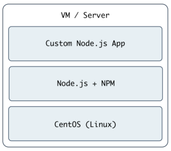
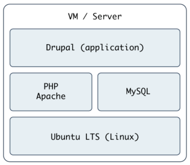
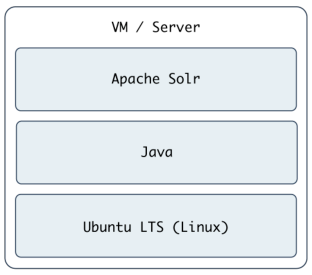

# Ansible Playbooks

## Power plays
Playbooks are written in [YAML](https://docs.ansible.com/ansible/latest/reference_appendices/YAMLSyntax.html), a simple human-readable syntax popular for defining configuration. Playbooks may be included within other playbooks, and certain metadata and options cause diffreent plays or playbooks to be run in different scnarios on different servers.

**Ad-hoc** command alone make Ansible a powerful tool.

**Playbooks** turn Ansible into a top-notch server provisioning and configuration management tool.

Attractive fact that easy to convert shell script (or one-off shell comamnds) directly into Ansible plays as followingscript:

### Shell Script
```bash
# Install Apache.
yum install --quiet -y httpd httpd-devel
# Copy configuration files.
cp httpd.conf /etc/httpd/conf/httpd.conf
cp httpd-vhosts.conf /etc/httpd/conf/httpd-vhosts.conf
# Start Apache and configure it to run at boot.
service httpd start
chkconfig httpd on
```
```bash
# (From the same directory in which the shell script reside).
$ ./shell-script.sh
```

### Ansible Playbooks
```yaml
---
- hosts: all
  tasks:
    - name: Install Apache.
      command: yum install --quiet -y httpd httpd-devel
    - name: Copy configuration files.
      command: >
        cp httpd.conf /etc/httpd/conf/httpd.conf
      command: >
        cp httpd-vhosts.conf /etc/httpd/conf/httpd-vhosts.conf
    - name: Start Apache and configure it to run at boot.
      command: service httpd start
      command: chkconfig httpd on
```
```bash
# (From the same directory in which the playbook resides).
$ ansible-playbook playbook.yml
```

### Revised Ansible Playbook - Now with idempotence!
:material-google-downasaur: [idempotence](https://reintech.io/blog/writing-idempotent-tasks-in-ansible)

??? "Idempoetence in Ansible"
    An idempotent task is one that can be executed multiple times without changing the system beyond the initial application, assuming no other changes were made to the system.

    **Benefits**:

    *   **Consistency**: Idempotent tasks ensure that your deployment will behave the same way every time it's run, which is critical for continuous integration and delivery pipelines.
    *   **Safety**: They can be rerun without fear of causing unexpected side effects or failures.
    *   **Efficiency**: Idempotent operations often check the current state before acting, which can prevent unnecessary changes and reduce execution time.
```yaml
---
- hosts: all
  become: yes

  tasks:
    - name: Install Apache.
      yum:
        name:
          - httpd
          - httpd-devel
        state: present

    - name: Copy configuration files.
      copy:
        src: "{{ item.src }}"
        dest: "{{ item.dest }}"
        owner: root
        group: root
        mode: 0644
      with_items:
        - src: httpd.conf
          dest: /etc/httpd/conf/httpd.conf
        - src: httpd-vhosts.conf
          dest: /etc/httpd/conf/httpd-vhosts.conf

    - name: Make sure Apache is started now and at boot.
      service:
        name: httpd
        state: started
        enable: yes
```

## Running Playbooks with `ansible-playbook`
### Limiting playbooks to particular hosts and groups
Limit the hosts on which the playbook is run:
```bash
# group `webservers` in case only even if set to `hosts:all` in playbook
$ ansible-playbook playbook.yml --limit webservers
```

Limit on one particular host:
```bash
$ ansible-playbook playbook.yml --limit xyz.example.com
```

To see a list of `hosts` that affected by playbook before actually run:
```bash
$ ansible-playbook playbook.yml --list-hosts
```

### Setting user and sudo options with `ansible-playbook`
If **no** `remote_user` is defined alongside the `hosts` in a playbook, Ansible assumes you'll connect as the user defined in your inventory file for a particular host, and then will fall back to your local user account name. Explicitly define a remote user to use for remote plays using the <span class="jade">--user (-u)</span> option.

Define a remote user to run playbook:
```bash
$ ansible-playbook playbook.yml --user=johndoe
```

!!! tip
    <span class="carrot">remote_user</span> option can be set in the `hosts` file or with the upon command line options:

    *   **-k, --ask-pass**: ask for connection password
    *   **--private-key=PRIVATE_KEY_FILE, --key-file=PRIVATE_KEY_FILE**: use this file to authenticate the connection
    *   **-u REMOTE_USER, --user=REMOTE_USER**: connect as this user (default=None)

    <span class="carrot">become_user</span> option can be set per playbook, task, or via the following connection options:

    *   **-b, --become**: run operations with become (does not imply password prompting)
    *   **--become-method=BECOME_METHOD**: privilege escalation method to use (default=sudo), valid choices: [ sudo | su | pbrun | pfexec | doas | dzdo | ksu | runas | pmrun ]
    *   **--become-user=BECOME_USER**: run operations as this user (default=root)
    *   **-K, --ask-become-pass**: ask for privilege escalation password

Prefer setting <span class="carrot">remote_user</span> in the `hosts` file and <span class="carrot">become_user</span> in the `command line` options because it's easier to change hosts files then playbooks.

<div class="grid cards" markdown>

-   <span class="vividgreen">:material-scale-balance:{ .lg .middle }</span> __`become_user`:__

    ---

    *   At the task level **_overrides_** at the playbook level **_overrides_** at the command switch level
    *   After initial development, don't **_specify_** at the playbook level- this will let you set it at the command option level (different servers need different ones for the same playbook) or at the task level (which, for most purposes, should only need `root`)
    *   If need to use `root` for a task, always use <span class="vividorange">become: true</span> and <span class="vividorange">become_user: root</span>. This will **_overrides_** whatever default <span class="carrot">become_user</span> is set.

    [:octicons-arrow-right-24: Ansible](https://docs.ansible.com/ansible/latest/playbook_guide/playbooks_privilege_escalation.html#not-supported-by-all-connection-plugins)

</div>

??? "sudo password"
    *   **--ask-become-pass (-K)** option: perform commands via sudo.
    *   **--become (-b)**: explicitly force all taks in a playbook to use sudo.
    *   **--become-user**: define the sudo user for tasks run via sudo (the default is root)

## Real-World playbook: Node.js app server
<figure markdown="span">
  [](../../assets/images/Nodejs.png "Nodejs")
 <!-- <figcaption>Node.js</figcaption> -->
</figure>

=== ":octicons-plug-16: playbook"
    ```yaml hl_lines="25"
    ---
    - hosts: all
      become: yes

      vars:
        node_apps_location: /usr/local/opt/node

        # - name: Ensure firewalld is stopped (since this is a test server).
          # service: name=firewalld state=stopped

        - name: Install Node.js and npm.
          dnf: name=npm state=present

        - name: Install pm2 (to run our Node.js app).
          npm: name=pm2 global=yes state=present

        - name: Ensure Node.js app folder exists.
          file: "path={{ node_apps_location }} state=directory"

        - name: Copy example Node.js app to server.
          copy: "src=app dest={{ node_apps_location }}"

        - name: Check list of running Node.js apps.
          command: /usr/local/bin/pm2 list
          register: pm2_list
          changed_when: false

        - name: Start example Node.js app.
          command: "/usr/local/bin/pm2 start {{ node_apps_location }}/app/app.js"
    ```
    !!! note
        1. `register` creates a new variable, `forever_list`, to be used in the next play to determine when to run the play.`register` stashes the output(stdout,stderr) of the defined command in the variable name passed to it.

=== ":octicons-telescope-16: javascript"
    ```js
    var http = require("http");
    var server = http.createServer(function (req, res) {
    res.writeHead(200);
    res.end("Hello world!");
    });
    server.listen(3000);
    ```

### Be able to visit at the browser
`http://HOST_NAME`

## Real-World playbook: Ubuntu LAMP server with Drupal
<figure markdown="span">
  [](../../assets/images/Drupal.png "Drupal")
 <!-- <figcaption>Drupal</figcaption> -->
</figure>

=== ":octicons-plug-16: playbook"
    ```yaml hl_lines="8 12 21-22 53-54 63 64 73 79 85 93 161"
    ---
    - hosts: all
      become: yes

      vars_files:
        - vars.yml

      pre_tasks:
        - name: Update apt cache if needed.
          apt: update_cache=yes cache_valid_time=3600

      handlers:
        - name: restart apache
          service: name=apache2 state=restarted

      tasks:
        - name: Get software for apt repository management.
          apt:
            state: present
            name:
              - python3-apt
              - python3-pycurl

        - name: Add ondrej repository for later versions of PHP.
          apt_repository: repo='ppa:ondrej/php' update_cache=yes

        - name: "Install Apache, MySQL, PHP, and other dependencies."
          apt:
            state: present
            name:
              - acl
              - git
              - curl
              - unzip
              - sendmail
              - apache2
              - php8.3-common
              - php8.3-cli
              - php8.3-dev
              - php8.3-gd
              - php8.3-curl
              - php8.3-opcache
              - php8.3-xml
              - php8.3-mbstring
              - php8.3-pdo
              - php8.3-mysql
              - php8.3-apcu
              - libpcre3-dev
              - libapache2-mod-php8.3
              - python3-mysqldb
              - mysql-server

        - name: Disable the firewall (since this is for local dev only).
          service: name=ufw state=stopped

        - name: "Start Apache, MySQL, and PHP."
          service: "name={{ item }} state=started enabled=yes"
          with_items:
            - apache2
            - mysql

        - name: Enable Apache rewrite module (required for Drupal).
          apache2_module: name=rewrite state=present
          notify: restart apache

        - name: Add Apache virtualhost for Drupal.
          template:
            src: "templates/drupal.test.conf.j2"
            dest: "/etc/apache2/sites-available/{{ domain }}.test.conf"
            owner: root
            group: root
            mode: 0644
          notify: restart apache

        - name: Enable the Drupal site.
          command: >
            a2ensite {{ domain }}.test
            creates=/etc/apache2/sites-enabled/{{ domain }}.test.conf
          notify: restart apache

        - name: Disable the default site.
          command: >
            a2dissite 000-default
            removes=/etc/apache2/sites-enabled/000-default.conf
          notify: restart apache

        - name: Adjust OpCache memory setting.
          lineinfile:
            dest: "/etc/php/8.3/apache2/conf.d/10-opcache.ini"
            regexp: "^opcache.memory_consumption"
            line: "opcache.memory_consumption = 96"
            state: present
          notify: restart apache

        - name: Create a MySQL database for Drupal.
          mysql_db: "db={{ domain }} state=present"

        - name: Create a MySQL user for Drupal.
          mysql_user:
            name: "{{ domain }}"
            password: "1234"
            priv: "{{ domain }}.*:ALL"
            host: localhost
            state: present

        - name: Download Composer installer.
          get_url:
            url: https://getcomposer.org/installer
            dest: /tmp/composer-installer.php
            mode: 0755

        - name: Run Composer installer.
          command: >
            php composer-installer.php
            chdir=/tmp
            creates=/usr/local/bin/composer

        - name: Move Composer into globally-accessible location.
          command: >
            mv /tmp/composer.phar /usr/local/bin/composer
            creates=/usr/local/bin/composer

        - name: Ensure Drupal directory exists.
          file:
            path: "{{ drupal_core_path }}"
            state: directory
            owner: www-data
            group: www-data

        - name: Check if Drupal project already exists.
          stat:
            path: "{{ drupal_core_path }}/composer.json"
          register: drupal_composer_json

        - name: Create Drupal project.
          composer:
            command: create-project
            arguments: drupal/recommended-project "{{ drupal_core_path }}"
            working_dir: "{{ drupal_core_path }}"
            no_dev: true
          become_user: www-data
          when: not drupal_composer_json.stat.exists

        - name: Add drush to the Drupal site with Composer.
          composer:
            command: require
            arguments: drush/drush*
            working_dir: "{{ drupal_core_path }}"
          become_user: www-data
          when: not drupal_composer_json.stat.exists

        - name: Install Drupal.
          command: >
            vendor/bin/drush si -y --site-name="{{ drupal_site_name }}"
            --account-name=admin
            --account-pass=admin
            --db-url=mysql://{{ domain }}:1234@localhost/{{ domain }}
            --root={{ drupal_core_path }}/web
            chdir={{ drupal_core_path }}
            creates={{ drupal_core_path }}/web/sites/default/settings.php
          notify: restart apache
          become_user: www-data
    ```
    !!! note "highlight"
        *   <span class="jade">**pre_tasks**</span>: let tasks to run before or after the main tasks(defined in `tasks:`) or roles(defined in roles:) respectively.
        *   <span class="jade">**handlers**</span>: special kids of tasks to run at the end of a play by adding the `notify` option to any of the tasks in that group.
        *   <span class="rouge">notify: restart apache</span>: call the handlers from a tasks.
        *   <span class="jade">**python3-apt** and **python3-pycurl**</span>: required for `apt_repository`, which allow Python to manage apt more precisely.
        *   <span class="jade">**apache2_module**</span>:  To remedy that situation when Apache may not have mod_rewrite enabled.

    !!! warning "handlers"
        By default, Ansible will **stop** all playbook execution when a task fails, and won't notify any handlers that may need to be triggered.
        In some cases, this leads to **unintended** side effects. If want to make sure handlers always run after a tasks uses `notify` to call the handler, even in case of playbook failure, add `--force-handlers` to ansible-playbook command.

    !!! abstract "firewall"
        On production server or any server exposed to the Internet, ports `22,80,443` are must be allowed through restrictive firewall.

    !!! quote "apache2_module"
        Apache may not have mod_rewrite enabled. To remedythat situation, use the command `sudo a2enmod rewrite`.
        [`apache2_module`](https://docs.ansible.com/ansible/latest/collections/community/general/apache2_module_module.html) module will do the samething with idempotent.

    !!! info "a2ensite"
        ```shell
        a2ensite, a2dissite - enable or disable an apache2 site / virtual host
        ```

    !!! success "notify"
        ```yaml
        - name: Enable the Drupal site.
          command: >
            a2ensite {{ domain }}.test
            creates=/etc/apache2/sites-enabled/{{ domain }}.test.conf
          notify: restart apache

        - name: Disable the default site.
          command: >
            a2dissite 000-default
            removes=/etc/apache2/sites-enabled/000-default.conf
          notify: restart apache
        ```
        Two tasks(lines **76-86**) enable the VirtualHost, and remove the default VirtualHost definition, which no longer need.
        But start the server, Apache will likely throw an _error_ since VitrualHost that defined which does not exist (`there's no directory at {{ drupal_core_path }}/web yest!`).

        That's why using <span class="rouge">notify</span> is important - instead of adding a task after three steps to restart Apache (which will fail the first time running the playbook).

        <span class="rouge">notify</span> will wait until after finished all the other steps in main group of tasks (holding time to finish setting up the server), then restart Aphache.

    !!! info "Install Drupal"
        ```yaml
        vendor/bin/drush si -y --site=name="{{ drupal_site_name }}"
        ```
        si: short for **site-install**

=== ":octicons-cpu-16: var"
    ```yaml
    ---
    # The path where Drupal will be downloaded and installed.
    drupal_core_path: "/var/www/drupal"

    # The resulting domain will be [domain].test (with .test appended).
    domain: "drupal"

    # Your Drupal site name.
    drupal_site_name: "Drupal Test"
    ```

=== ":octicons-project-roadmap-16: template"
    ```jinja
    <VirtualHost *:80>
        ServerAdmin webmaster@localhost
        ServerName {{ domain }}.test
        ServerAlias www.{{ domain }}.test
        DocumentRoot {{ drupal_core_path }}/web
        <Directory "{{ drupal_core_path }}/web">
            Options FollowSymLinks Indexes
            AllowOverride All
        </Directory>
    </VirtualHost>

    ```
=== ":octicons-rocket-16: host.ini"
    ```ini
    [app]
    ubuncld

    [box:children]
    app

    [box:vars]
    ansible_user=johndoe
    ansible_ssh_private_key_file=/PATH/TO/PUBKEY
    ```
### Be able to visit at the browser
`http://HOST_NAME`

### Ansible command module
!!! abstract "Ansible command module > shell > raw"
    Ansible's `command` module is the preferred option for running commands on a host. But doesn't working on options, like `<,>,|,&`, and local env variables like `$HOME` as well as pip output to other command, etc.

:material-google-downasaur: [Composer](https://docs.ansible.com/ansible/latest/collections/ansible/builtin/user_module.html)
:material-google-downasaur: [Drush](https://docs.ansible.com/ansible/latest/collections/ansible/builtin/user_module.html)
:material-google-downasaur: [Drupal](https://www.drupal.org/drupal-wiki)

## Real-World playbook: Ubuntu server with Solr
<figure markdown="span">
  [](../../assets/images/Solr.png "Solr")
 <!-- <figcaption>Solr</figcaption> -->
</figure>

=== ":octicons-plug-16: playbook"
    ```yaml hl_lines="20"
    ---
    - hosts: all
      become: true

      vars_files:
        - vars.yml

      pre_tasks:
        - name: Update apt cache if needed.
          apt: update_cache=true cache_valid_time=3600

      tasks:
        - name: Install Java.
          apt: name=openjdk-11-jdk state=present

        - name: Download Solr.
          get_url:
            url: "https://archive.apache.org/dist/lucene/solr/{{ solr_version }}/solr-{{ solr_version }}.tgz"
            url: "https://archive.apache.org/dist/solr/solr/{{ solr_version }}/solr-{{ solr_version }}.tgz"
            dest: "{{ download_dir }}/solr-{{ solr_version }}.tgz"
            checksum: "{{ solr_checksum }}"

        - name: Expand Solr.
          unarchive:
            src: "{{ download_dir }}/solr-{{ solr_version }}.tgz"
            dest: "{{ download_dir }}"
            remote_src: true
            creates: "{{ download_dir }}/solr-{{ solr_version }}/README.txt"

        - name: Run Solr installation script.
          command: >
            {{ download_dir }}/solr-{{ solr_version }}/bin/install_solr_service.sh
            {{ download_dir }}/solr-{{ solr_version }}.tgz
            -i /opt
            -d /var/solr
            -u solr
            -s solr
            -p 8983
            creates={{ solr_dir }}/bin/solr

        - name: Adjust setting for Solr public access
          lineinfile:
            path: /etc/default/solr.in.sh
            regexp: '^SOLR_JETTY_HOST'
            insertafter: '^#SOLR_JETTY_HOST'
            line: SOLR_JETTY_HOST="0.0.0.0"
            state: present

        - name: Restart Solr Service
          service: name=solr state=restarted
    ```

!!! warning
    If pass a directory to the `dest` parameter, Ansible will place the file inside, but will always **re-download** the file on subsequent runs of the playbook (and overwrite the existing download if it has changed).

    <span class="green", font-weight=small, font-size=10px>**To avoid this extra overhead, give the full path to the download file.**</span>

=== ":octicons-cpu-16: var"
    ```yaml
    ---
    # The directory into which Solr will be downloaded for setup.
    download_dir: /tmp

    # The directory inside which Solr will be installed.
    solr_dir: /opt/solr

    # Solr version and download information.
    # solr_version: 8.11.3
    # solr_checksum: sha512:10f09b163bd9c31b2a8fdf889cf624114648e76881d69a4c096d473272c47b3cbe37ec9f9bd1980fd90967352c4052477065e165127eccb2c49a60c8d9860afc
    solr_version: 9.6.1
    solr_checksum: sha512:7e16aa71fc01f9d9b05e5514e35798104a18253a211426aa669aa3b91225d110a4fa1c78c9ec86b7e1909e2aae63696deffd877536790303cd0638eb7f1a8c63
    ```

=== ":octicons-rocket-16: host.ini"
    ```ini
    [app]
    ubuncld

    [box:children]
    app

    [box:vars]
    ansible_user=johndoe
    ansible_ssh_private_key_file=/PATH/TO/PUBKEY
    ```
=== ":octicons-webhook-16: solr collection"
    ```bash
    # Create a New Solr Collection - mycol1
    sudo su - solr -c "/opt/solr/bin/solr create -c mycol1 -n data_driven_schema_configs"
    ```

### Be able to access the Solr admin interface on the browser
`http://HOST_NAME:8983`

### Check Solr Service Port
```bash
sudo ss -tnlp | grep 8983
```
