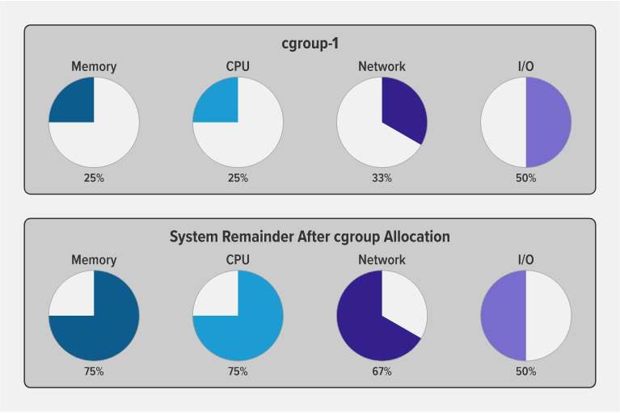

# cgoups

A control group (cgroup) is a Linux kernel feature that limits, accounts for, and isolates the resource usage (CPU, memory, disk I/O, network, and so on) of a collection of processes.

Cgroups provide the following features:

- Resource limits – You can configure a cgroup to limit how much of a particular resource (memory or CPU, for example) a process can use.

- Prioritization – You can control how much of a resource (CPU, disk, or network) a process can use compared to processes in another cgroup when there is resource contention.

- Accounting – Resource limits are monitored and reported at the cgroup level.

- Control – You can change the status (frozen, stopped, or restarted) of all processes in a cgroup with a single command.

Basically, you use cgroups to control how much of a given key resource (CPU, memory, network, and disk I/O) can be accessed or used by a process or set of processes. Cgroups are a key component of containers because there are often multiple processes running in a container that you need to control together. In a Kubernetes environment, cgroups can be used to implement resource requests and limits and corresponding QoS classes at the pod level.

The following diagram illustrates how when you allocate a particular percentage of available system resources to a cgroup (in this case cgroup‑1), the remaining percentage is available to other cgroups (and individual processes) on the system.

## Cgroup Versions
According to Wikipedia, the first version of cgroups was merged into the Linux kernel mainline in late 2007 or early 2008, and “the documentation of cgroups‑v2 first appeared in [the] Linux kernel … [in] 2016”. Among the many changes in version 2, the big ones are a much simplified tree architecture, new features and interfaces in the cgroup hierarchy, and better accommodation of “rootless” containers (with non‑zero UIDs).

The new interface in v2 is for [__<ins>pressure stall information (PSI)<ins>__](https://www.kernel.org/doc/html/latest/accounting/psi.html). It provides insight into per‑process memory use and allocation in a much more granular way than was previously possible (this is beyond the scope of this blog, but is a very cool topic).

## Conclusion
Namespaces and cgroups are the building blocks for containers and modern applications. Having an understanding of how they work is important as we refactor applications to more modern architectures.

Namespaces provide isolation of system resources, and cgroups allow for fine‑grained control and enforcement of limits for those resources.

Containers are not the only way that you can use namespaces and cgroups. Namespaces and cgroup interfaces are built into the Linux kernel, which means that other applications can use them to provide separation and resource constraints.
