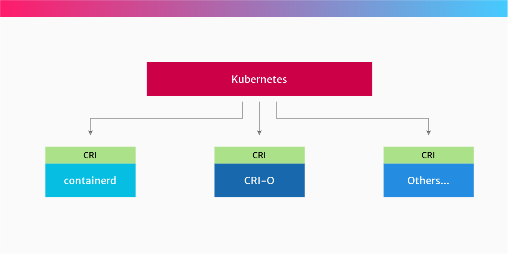

# containerd

Containerd – An abstraction of kernel features that provides a relatively high level container interface. Other software projects can use this to run containers and manage container images.

__Ecosystem__

## Container Runtime Interface (CRI)

__CRI is the API that Kubernetes uses to control the different runtimes that create and manage containers.__

__CRI__ makes it easier for Kubernetes to use different container runtimes. Instead of the Kubernetes project having to manually add support for each runtime, the __CRI API__ describes how Kubernetes interacts with each runtime. So it’s up to the runtime how to actually manage containers, as long as it __*obeys*__ the CRI API.

So if you prefer to use [containerd](#containerd) to run your containers, you can. Or, if you prefer to use __CRI-O__, then you can. This is because both of these runtimes implement the [CRI](#container-runtime-interface-cri) spec.

If you’re an end user, the implementation mostly shouldn’t matter. These CRI implementations are intended to be pluggable and seamlessly changeable.

__Your choice of runtime might be important if you pay to get support (security, bug fixes etc) from a vendor.__
For example, Red Hat’s OpenShift uses __CRI-O__, and offers support for it. Docker provides support for their own [containerd](#containerd).

<!-- 

How to check your container runtime in Kubernetes

In Kubernetes architecture, the kubelet (the agent that runs on each node) is responsible for sending instructions to the container runtime to start and run containers.

You can check which container runtime you’re using by looking at the kubelet parameters on each node. There’s an option --container-runtime and --container-runtime-endpoint which are used to configure which runtime to use.

 -->

??? question "How to check your container runtime in Kubernetes?"

    In Kubernetes architecture, the __kubelet__ (the agent that runs on each node) is responsible for sending instructions to the container runtime to start and run containers.

You can check which container runtime you’re using by looking at the __kubelet__ parameters on each node. There’s an option **--container-runtime**{: style="color: green; opacity: 0.60"} and **--container-runtime-endpoint**{: style="color: green; opacity: 0.60"} which are used to configure which runtime to use.

## Containerd

__containerd is a high-level container runtime that came from Docker, and implements the CRI spec. It pulls images from registries, manages them and then hands over to a lower-level runtime, which actually creates and runs the container processes.__

__containerd__ was separated out of the Docker project, to make Docker more modular.
 So Docker uses containerd internally itself. When you install Docker, it will also install containerd.
__containerd__ implements the Kubernetes Container Runtime Interface (CRI), via its cri plugin.

### CRI-O

__CRI-O is another high-level container runtime which implements the Container Runtime Interface (CRI). It’s an alternative to containerd. It pulls container images from registries, manages them on disk, and launches a lower-level runtime to run container processes.__

Yes, CRI-O is another container runtime. It was born out of Red Hat, IBM, Intel, SUSE and others.

It was specifically created from the ground up as a container runtime for Kubernetes. It provides the ability to start, stop and restart containers, just like containerd.

## Open Container Initiative (OCI)

__The OCI is a group of tech companies who maintain a specification for the container image format, and how containers should be run.__

The idea behind the OCI is that you can choose between different runtimes which conform to the spec. Each of these runtimes have different lower-level implementations.

For example, you might have one OCI-compliant runtime for your Linux hosts, and one for your Windows hosts.

This is the benefit of having one standard that can be implemented by many different projects. This same “one standard, many implementations” approach is in use everywhere, from Bluetooth devices to Java APIs.

### runc

__runc__ is an OCI-compatible container runtime. It implements the OCI specification and runs the container processes.

__runc__ is called the reference implementation of OCI.

??? question "What is a reference implementation?"
    A reference implementation is a piece of software that has implemented all the requirements of a specification or standard.

    It’s usually the first piece of software which is developed from the specification.

    In the case of OCI, __runc__ provides all the features expected of an OCI-compliant runtime, although anyone can implement their own OCI runtime if they like.

runc provides all of the low-level functionality for containers, interacting with existing low-level Linux features, like namespaces and control groups. It uses these features to create and run container processes.

A couple of alternatives to __runc__ are:

- crun a container runtime written in C (by contrast, runc is written in Go.)

- kata-runtime from the Katacontainers project, which implements the OCI specification as individual lightweight VMs (hardware virtualisation

- gVisor from Google, which creates containers that have their own kernel. It implements OCI in its runtime called runsc.

??? question "What's the equivalent of runc on Windows?"

    __runc__ is a tool for running containers on Linux. So that means it runs on Linux, on bare metal or inside a VM.

On Windows, it’s slightly different. The equivalent of runc is Microsoft’s Host Compute Service (HCS). It includes a tool called runhcs, which itself is a fork of runc, and also implements the Open Container Initiative specification.
