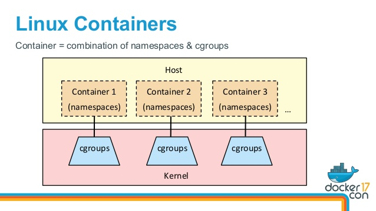
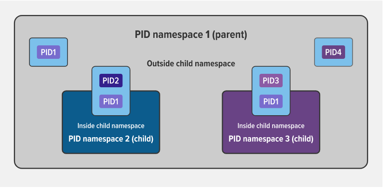

# Namespace
Namespace are a feature of the Linux kernel that partitions kernel resources such that one set of processes sees one set of resources while another set of processes sees a different set of resources.

## [Types of Namespaces](https://man7.org/linux/man-pages/man7/namespaces.7.html)

Within the Linux kernel, there are different types of namespaces. Each namespace has its own unique properties:

- user namespace has its own set of user IDs and group IDs for assignment to processes. In particular, this means that a process can have root privilege within its user namespace without having it in other user namespaces.

- process ID (PID) namespace assigns a set of PIDs to processes that are independent from the set of PIDs in other namespaces. The first process created in a new namespace has PID 1 and child processes are assigned subsequent PIDs. If a child process is created with its own PID namespace, it has PID 1 in that namespace as well as its PID in the parent process’ namespace. See [below](#an-example-of-parent-and-child-pid-namespaces) for an example.

- network namespace has an independent network stack: its own private routing table, set of IP addresses, socket listing, connection tracking table, firewall, and other network‑related resources.

- mount namespace has an independent list of mount points seen by the processes in the namespace. This means that you can mount and unmount filesystems in a mount namespace without affecting the host filesystem.

- An interprocess communication (IPC) namespace has its own IPC resources, for example POSIX message queues.

- A UNIX Time‑Sharing (UTS) namespace allows a single system to appear to have different host and domain names to different processes.

## An Example of Parent and Child PID Namespaces

In the diagram above, there are three PID namespaces – a parent namespace and two child namespaces. Within the parent namespace, there are four processes, named PID1 through PID4. These are normal processes which can all see each other and share resources.

The child processes with PID2 and PID3 in the parent namespace also belong to their own PID namespaces in which their PID is 1. From within a child namespace, the PID1 process cannot see anything outside. For example, PID1 in both child namespaces cannot see PID4 in the parent namespace.

This provides isolation between (in this case) processes within different namespaces.

## Conclusion
Namespaces and cgroups are the building blocks for containers and modern applications. Having an understanding of how they work is important as we refactor applications to more modern architectures.

Namespaces provide isolation of system resources, and cgroups allow for fine‑grained control and enforcement of limits for those resources.

Containers are not the only way that you can use namespaces and cgroups. Namespaces and cgroup interfaces are built into the Linux kernel, which means that other applications can use them to provide separation and resource constraints.
