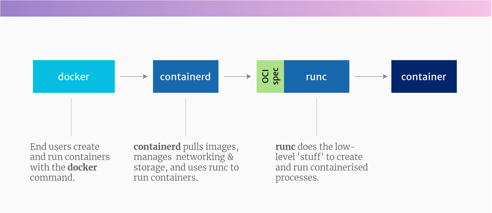

# Docker

Docker – A developer-oriented software with a high level interface that lets you easily build and run containers from your terminal. It now uses containerd as its container runtime.

We have to start with Docker because it’s the most popular developer tool for working with containers. And for a lot of people, the name “Docker” itself is synonymous with the word “container”.

Docker kick-started this whole revolution. Docker created a very ergonomic (nice-to-use) tool for working with containers – also calleddocker.

## Container in Docker

docker is designed to be installed on a workstation or server and comes with a bunch of tools to make it easy to build and run containers as a developer, or DevOps person.

The docker command line tool can build container images, pull them from registries, create, start and manage containers.

To make all of this happen, the experience you know as docker is now comprised of these projects (there are others, but these are the main ones):

- docker-cli: This is the command-line utility that you interact with using docker ... commands.

- containerd: This is a daemon process that manages and runs containers. It pushes and pulls images, manages storage and networking, and supervises the running of containers.

- runc: This is the low-level container runtime (the thing that actually creates and runs containers). It includes libcontainer, a native Go-based implementation for creating containers.

In reality, when you run a container with docker, you’re actually running it through the Docker daemon, containerd, and then runc.

## Dockershim: Docker in Kubernetes

Kubernetes includes a component called __dockershim__, which allows it to support Docker.

Kubernetes prefers to run containers through any __container runtime__ which supports its __Container Runtime Interface (CRI)__.

But Docker, being older than Kubernetes, doesn’t implement CRI. So that’s why the __dockershim__ exists, to basically bolt Docker onto Kubernetes. Or Kubernetes onto Docker, whichever way round you prefer to think of it.

??? question "What is a shim?"

    In tech terms, a __shim__ is a component in a software system, which acts as a bridge between different APIs, or as a compatibility layer. A shim is sometimes added when you want to use a third-party component, but you need a little bit of glue code to make it work.

Going forward, Kubernetes will remove support for Docker directly, and prefer to use only container runtimes that implement its Container Runtime Interface. This probably means using containerd or CRI-O.

__But this doesn’t mean that Kubernetes won’t be able to run Docker-formatted containers__. Both containerd and CRI-O can run Docker-formatted (actually OCI-formatted) images, they just do it without having to use the docker command or the Docker daemon.

Phew. Hope that cleared that up.

## Docker images

__What many people refer to as Docker images, are actually images packaged in the Open Container Initiative (OCI) format.__

So if you pull an image from Docker Hub, or another registry, you should be able to use it with the docker command, or on a Kubernetes cluster, or with the podman utility, or any other tool that supports the OCI image format spec.
