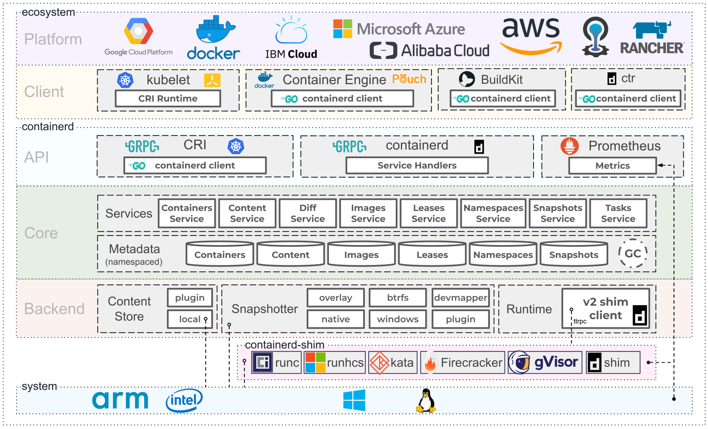

## K8s architecture

A daemon for Linux and Windows. It manages the complete container lifecycle of its host system, from image transfer and storage to container execution and supervision to low-level storage to network attachments and beyond.

### Architecture

<!-- Picture unClickable Markdown

e.g:
![Architecture]
[Architecture]:Containerd-Architecture/Architecture.png -->

<!-- Picture Clickable Markdown
 -->

