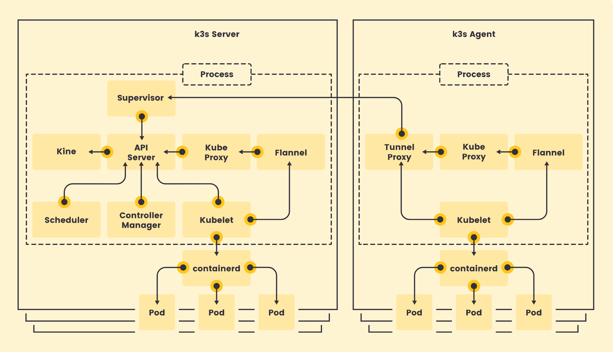

# K3s

## Abstract

Lightweight Kubernetes. Production ready, easy to install, half the memory, all in a binary less than 100 MB.
Great for:

- [x] Edge
- [x] IoT
- [x] CI
- [x] Development
- [x] ARM
- [x] Embedding k8s
- [x] Situations where a PhD in k8s clusterology is infeasible

## Architecture

[](../../assets/images/K3s-architecture-single-server.png "K3s-architecture-single-server")

 __How it works__
 [](../../assets/images/K3s-how-it-works.png "K3s-how-it-works")

### [__<ins>alpine Linux</ins>__](https://alpinelinux.org/downloads/):

mini requirement can be used by virtual systems which optimized by slimmed down the kernel.

!!! warning
	In order to set up Alpine Linux, you have to go through the following preparation:
	Update /etc/update-extlinux.conf by adding:

	``` yaml
	default_kernel_opts="...  cgroup_enable=cpuset cgroup_memory=1 cgroup_enable=memory"
	```
	``` yaml
	update-extlinux
	reboot
	```

``` bash
curl -sfL https://get.k3s.io | K3S_KUBECONFIG_MODE="644" sh -s
```
