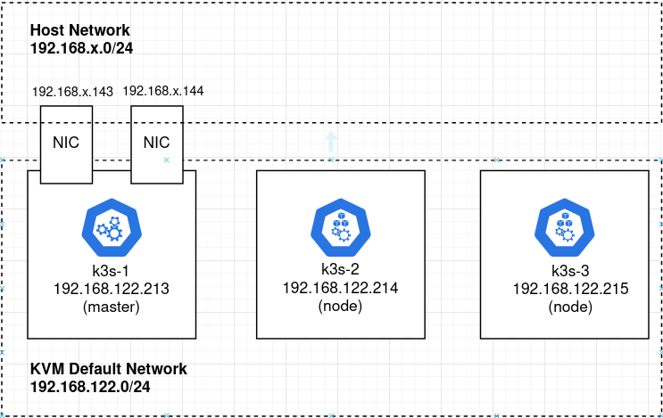

# K3s cluster on Ubuntu using terraform and libvirt

[**K3s**](https://rancher.com/docs/k3s/latest/en/) is a lightweight Kubernetes deployment by Rancher that is fully compliant, yet also compact enough to run on development boxes and edge devices.

In this article, I will show you how to deploy a  three-node K3s cluster on Ubuntu nodes that are created using Terraform and a local KVM [**libvirt provider**](https://github.com/dmacvicar/terraform-provider-libvirt).

[](../../assets/images/k3s-3nodes-diagram.png)

## Creating node VMs

We will deploy this K3s cluster on three independent guests running Ubuntu.

These Ubuntu VMs could actually be created using any hypervisor or  hyperscaler, but for this article we will use Terraform and the local `#!css KVM libvirt provider` to create guests named: `#!css k3s-1, k3s-2, k3s-3`.   We will place them on the standard KVM default network, `#!yaml 192.168.122.0/24`.

Install Terraform, its libvirt provider, and KVM as described in a previous article.  Then use my github project to create the three Ubuntu guest OS.

``` bash
# required packages
sudo apt install make git curl -y

# github project with terraform to create guest OS
git clone https://github.com/fabianlee/k3s-cluster-kvm.git
cd k3s-cluster-kvm

# run terraform init and apply
cd tf-libvirt

# make ssh keypair for login as 'ubuntu'
ssh-keygen -t rsa -b 4096 -f id_rsa -C tf-libvirt -N "" -q

# initialize terraform and its plugins
terraform init

# do creation
terraform apply -auto-approve
```

The KVM guests can now be listed using virsh.  I have embedded the IP address in the libvirt domain name to make the address obvious.

``` bash
# should show three running k3s VMs
$ virsh list
Id Name State
--------------------------------------------
...
10 k3s-1-192.168.122.213 running
11 k3s-2-192.168.122.214 running
12 k3s-1-192.168.122.215 running
```

[**cloud-init**](https://help.ubuntu.com/community/CloudInit) has been used to give the ‘ubuntu’ user an ssh keypair for login, which allows us to validate the login for each host using the command below.

``` bash
# accept key as known_hosts
for octet in $(seq 213 215); do ssh-keyscan -H 192.168.122.$octet >> ~/.ssh/known_hosts; done

# test ssh into remote host
for octet in $(seq 213 215); do ssh -i id_rsa ubuntu@192.168.122.$octet "hostname -f; uptime"; done
```

## Updating hosts files for K3s cluster

To allow all the VMs participating in the K3s cluster to see each other, add entries to `#!css /etc/hosts`.  Do this either manually like below:

``` yaml
# login to each host manually
# ssh -i id_rsa ubuntu@192.168.122.[213-215]

# add these entries to each /etc/hosts
k3s-1 192.168.122.213
k3s-2 192.168.122.214
k3s-3 192.168.122.215
```

Or you can use this single command.

``` bash
for octet in $(seq 213 215); do ssh -i id_rsa ubuntu@192.168.122.$octet 'echo -e "k3s-1 192.168.122.213\nk3s-2 192.168.122.214\nk3s-3 192.168.122.215" | sudo tee -a /etc/hosts'; done
```

## Install master K3s node

Login manually to the K3s master node (.213) and run these commands.

``` bash
# login to master
$ ssh -i id_rsa ubuntu@192.168.122.213

# install
$ sudo curl -sfL https://get.k3s.io | sh -

[INFO]  Finding release for channel stable
[INFO]  Using v1.21.4+k3s1 as release
[INFO]  Downloading hash https://github.com/k3s-io/k3s/releases/download/v1.21.4+k3s1/sha256sum-amd64.txt
[INFO]  Downloading binary https://github.com/k3s-io/k3s/releases/download/v1.21.4+k3s1/k3s
[INFO]  Verifying binary download
[INFO]  Installing k3s to /usr/local/bin/k3s
[INFO]  Creating /usr/local/bin/kubectl symlink to k3s
[INFO]  Creating /usr/local/bin/crictl symlink to k3s
[INFO]  Creating /usr/local/bin/ctr symlink to k3s
[INFO]  Creating killall script /usr/local/bin/k3s-killall.sh
[INFO]  Creating uninstall script /usr/local/bin/k3s-uninstall.sh
[INFO]  env: Creating environment file /etc/systemd/system/k3s.service.env
[INFO]  systemd: Creating service file /etc/systemd/system/k3s.service
[INFO]  systemd: Enabling k3s unit
Created symlink /etc/systemd/system/multi-user.target.wants/k3s.service → /etc/systemd/system/k3s.service.
[INFO]  systemd: Starting k3s
```

And then do a validation to ensure the service is started and kubectl reports back a single master node.

``` yaml
# validate service, status should say 'active (running)'
$ sudo systemctl status k3s --no-pager | head -n5
k3s.service - Lightweight Kubernetes
     Loaded: loaded (/etc/systemd/system/k3s.service; enabled; vendor preset: enabled)
     Active: active (running) since Sun 2021-09-12 20:39:32 UTC; 5min ago
       Docs: https://k3s.io
    Process: 3050 ExecStartPre=/bin/sh -xc ! /usr/bin/systemctl is-enabled --quiet nm-cloud-setup.service (code=exited, status=0/SUCCESS)

# validate that kubectl returns single master
$ sudo kubectl get nodes -o wide
NAME    STATUS   ROLES                  AGE    VERSION        INTERNAL-IP       EXTERNAL-IP   OS-IMAGE             KERNEL-VERSION     CONTAINER-RUNTIME
k3s-1   Ready    control-plane,master   7m3s   v1.21.4+k3s1   192.168.122.213           Ubuntu 20.04.3 LTS   5.4.0-84-generic   containerd://1.4.9-k3s1
```

The master node has a file `#!css “/var/lib/rancher/k3s/server/node-token”` which we will use in the next section to add nodes to the cluster.

## Join K3s nodes to the cluster

In order to add K3s nodes to the master, we need to use the key found on the master at {++ “/var/lib/rancher/k3s/server/node-token”++}.  So let’s capture that value.

``` bash
k3s_master=192.168.122.213

# grab node token from master
node_token=$(ssh -i id_rsa ubuntu@$k3s_master "sudo cat /var/lib/rancher/k3s/server/node-token")

echo node_token from master is $node_token
```

To create a cluster run the get.k3s.io script just like the master, but this time add parameters for the master node IP and node token.

``` bash
# install on k3s-2, join cluster
$ ssh -i id_rsa ubuntu@192.168.122.214 "sudo curl -sfL http://get.k3s.io | K3S_URL=https://${k3s_master}:6443 K3S_TOKEN=${node_token} sh -"
[INFO]  Finding release for channel stable
[INFO]  Using v1.21.4+k3s1 as release
[INFO]  Downloading hash https://github.com/k3s-io/k3s/releases/download/v1.21.4+k3s1/sha256sum-amd64.txt
[INFO]  Downloading binary https://github.com/k3s-io/k3s/releases/download/v1.21.4+k3s1/k3s
[INFO]  Verifying binary download
[INFO]  Installing k3s to /usr/local/bin/k3s
[INFO]  Creating /usr/local/bin/kubectl symlink to k3s
[INFO]  Creating /usr/local/bin/crictl symlink to k3s
[INFO]  Creating /usr/local/bin/ctr symlink to k3s
[INFO]  Creating killall script /usr/local/bin/k3s-killall.sh
[INFO]  Creating uninstall script /usr/local/bin/k3s-agent-uninstall.sh
[INFO]  env: Creating environment file /etc/systemd/system/k3s-agent.service.env
[INFO]  systemd: Creating service file /etc/systemd/system/k3s-agent.service
[INFO]  systemd: Enabling k3s-agent unit
Created symlink /etc/systemd/system/multi-user.target.wants/k3s-agent.service → /etc/systemd/system/k3s-agent.service.
[INFO]  systemd: Starting k3s-agent
```

In the same way, join the k3s-3 node.

``` bash
# install on k3s-3, join cluster
$ ssh -i id_rsa ubuntu@192.168.122.214 "sudo curl -sfL http://get.k3s.io | K3S_URL=https://${k3s_master}:6443 K3S_TOKEN=${node_token} sh -"
```

## Validate Kubernetes Cluster

A call to kubectl should now show all 3 nodes participating in the Kubernetes cluster.

``` bash
$ ssh -i id_rsa ubuntu@192.168.122.213 "sudo kubectl get nodes"

NAME    STATUS   ROLES                  AGE    VERSION
k3s-2   Ready                     10m    v1.21.4+k3s1
k3s-3   Ready                     4m7s   v1.21.4+k3s1
k3s-1   Ready    control-plane,master   32m    v1.21.4+k3s1
```

## Validate app deployment to cluster

As a quick test of the Kubernetes cluster, create a test deployment of the whoami app which is exposed using the default `K3s Traefik ingress`.

``` yaml
# copy deployment manifest to master
scp -i id_rsa whoami_traefik_example.yml ubuntu@192.168.122.213:.

# login to master
ssh -i id_rsa ubuntu@192.168.122.213

# apply manifest
$ sudo kubectl apply -f whoami_traefik_example.yml
deployment.apps/whoami-ds created
service/whoami-service created
ingressroute.traefik.containo.us/whoami-ingressroute created

# exposed services should now have 'whoami-service'
$ sudo kubectl get services
NAME             TYPE        CLUSTER-IP     EXTERNAL-IP   PORT(S)   AGE
kubernetes       ClusterIP   10.43.0.1              443/TCP   49m
whoami-service   ClusterIP   10.43.210.80           80/TCP    40s

# put ClusterIP of whoami service into variable
cluster_ip=$(sudo kubectl get service/whoami-service -o=jsonpath="{.spec.clusterIP}")

# curl to service ClusterIP
$ curl http://$cluster_ip/whoami

Hostname: whoami-ds-78447d957f-jnfrw
IP: 127.0.0.1
IP: ::1
IP: 10.42.1.3
IP: fe80::18:13ff:febc:c0fb
RemoteAddr: 10.42.0.0:18326
GET /whoami HTTP/1.1
Host: 10.43.210.80
User-Agent: curl/7.68.0
Accept: */*

# also exposed by Traefik
$ sudo kubectl get service traefik -n kube-system
NAME      TYPE           CLUSTER-IP      EXTERNAL-IP                                       PORT(S)                      AGE
traefik   LoadBalancer   10.43.214.196   192.168.122.213,192.168.122.214,192.168.122.215   80:30180/TCP,443:31528/TCP   59m

# available here from master node
$ curl http://localhost/whoami
$ curl http://k3s-1.local/whoami

# leave ssh session
exit
```

And Traefik also exposes this service externally.

``` yaml
# available also outside cluster
$ curl http://192.168.122.213/whoami
Hostname: whoami-ds-78447d957f-jnfrw
IP: 127.0.0.1
IP: ::1
IP: 10.42.1.3
IP: fe80::18:13ff:febc:c0fb
RemoteAddr: 10.42.0.8:35890
GET /whoami HTTP/1.1
Host: 192.168.122.213
User-Agent: curl/7.68.0
Accept: */*
Accept-Encoding: gzip
X-Forwarded-For: 10.42.0.1
X-Forwarded-Host: 192.168.122.213
X-Forwarded-Port: 80
X-Forwarded-Proto: http
X-Forwarded-Server: traefik-97b44b794-k6bbx
X-Real-Ip: 10.42.0.1

# available at each cluster node
$ curl http://192.168.122.214/whoami
$ curl http://192.168.122.215/whoami
```

## View traefik dashboard

``` bash
# http://127.0.0.1:9000/dashboard
kubectl port-forward -n kube-system pod/traefik-97b44b794-4mpx5 9000:9000
```

k3s config.toml for configuration of containerd

``` bash
sudo vi /var/lib/rancher/k3s/agent/etc/containerd/config.toml
```
