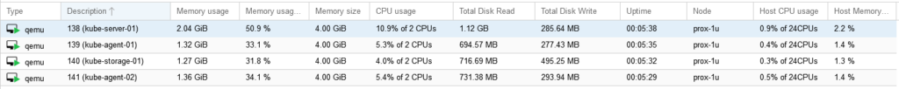

# Deploying Kubernetes VMs in Proxmox with Terraform

## Kubernetes Proxmox Terraform Template

Without further ado, below is the template I used to create my virtual machines. The main LAN network is 10.98.1.0/24, and the Kube internal network (on its own bridge) is 10.17.0.0/24.

This template creates a Kube server, two agents, and a storage server.

``` json
terraform {
  required_providers {
    proxmox = {
      source = "telmate/proxmox"
      version = "2.7.4"
    }
  }
}

provider "proxmox" {
  pm_api_url = "https://prox-1u.home.fluffnet.net:8006/api2/json"
  pm_api_token_id = [secret]
  pm_api_token_secret = [secret]
  pm_tls_insecure = true
}

resource "proxmox_vm_qemu" "kube-server" {
  count = 1
  name = "kube-server-0${count.index + 1}"
  target_node = "prox-1u"

  clone = "ubuntu-2004-cloudinit-template"

  agent = 1
  os_type = "cloud-init"
  cores = 2
  sockets = 1
  cpu = "host"
  memory = 4096
  scsihw = "virtio-scsi-pci"
  bootdisk = "scsi0"

  disk {
    slot = 0
    size = "10G"
    type = "scsi"
    storage = "local-zfs"
    #storage_type = "zfspool"
    iothread = 1
  }

  network {
    model = "virtio"
    bridge = "vmbr0"
  }

  network {
    model = "virtio"
    bridge = "vmbr17"
  }

  lifecycle {
    ignore_changes = [
      network,
    ]
  }

  ipconfig0 = "ip=10.98.1.4${count.index + 1}/24,gw=10.98.1.1"
  ipconfig1 = "ip=10.17.0.4${count.index + 1}/24"
  sshkeys = <<EOF
  ${var.ssh_key}
  EOF
}

resource "proxmox_vm_qemu" "kube-agent" {
  count = 2
  name = "kube-agent-0${count.index + 1}"
  target_node = "prox-1u"

  clone = "ubuntu-2004-cloudinit-template"

  agent = 1
  os_type = "cloud-init"
  cores = 2
  sockets = 1
  cpu = "host"
  memory = 4096
  scsihw = "virtio-scsi-pci"
  bootdisk = "scsi0"

  disk {
    slot = 0
    size = "10G"
    type = "scsi"
    storage = "local-zfs"
    #storage_type = "zfspool"
    iothread = 1
  }

  network {
    model = "virtio"
    bridge = "vmbr0"
  }

  network {
    model = "virtio"
    bridge = "vmbr17"
  }

  lifecycle {
    ignore_changes = [
      network,
    ]
  }

  ipconfig0 = "ip=10.98.1.5${count.index + 1}/24,gw=10.98.1.1"
  ipconfig1 = "ip=10.17.0.5${count.index + 1}/24"
  sshkeys = <<EOF
  ${var.ssh_key}
  EOF
}

resource "proxmox_vm_qemu" "kube-storage" {
  count = 1
  name = "kube-storage-0${count.index + 1}"
  target_node = "prox-1u"

  clone = "ubuntu-2004-cloudinit-template"

  agent = 1
  os_type = "cloud-init"
  cores = 2
  sockets = 1
  cpu = "host"
  memory = 4096
  scsihw = "virtio-scsi-pci"
  bootdisk = "scsi0"

  disk {
    slot = 0
    size = "20G"
    type = "scsi"
    storage = "local-zfs"
    #storage_type = "zfspool"
    iothread = 1
  }

  network {
    model = "virtio"
    bridge = "vmbr0"
  }

  network {
    model = "virtio"
    bridge = "vmbr17"
  }

  lifecycle {
    ignore_changes = [
      network,
    ]
  }

  ipconfig0 = "ip=10.98.1.6${count.index + 1}/24,gw=10.98.1.1"
  ipconfig1 = "ip=10.17.0.6${count.index + 1}/24"
  sshkeys = <<EOF
  ${var.ssh_key}
  EOF
}
```

After running Terraform plan and apply, you should have 4 new VMs in your Proxmox cluster:

[](../../assets/images/KubernetesVM.png "KubernetesVM")

## Conclusion

You now have 4 VMs ready for Kubernetes installation. The next post will show how to install Kubernetes with Ansible.
