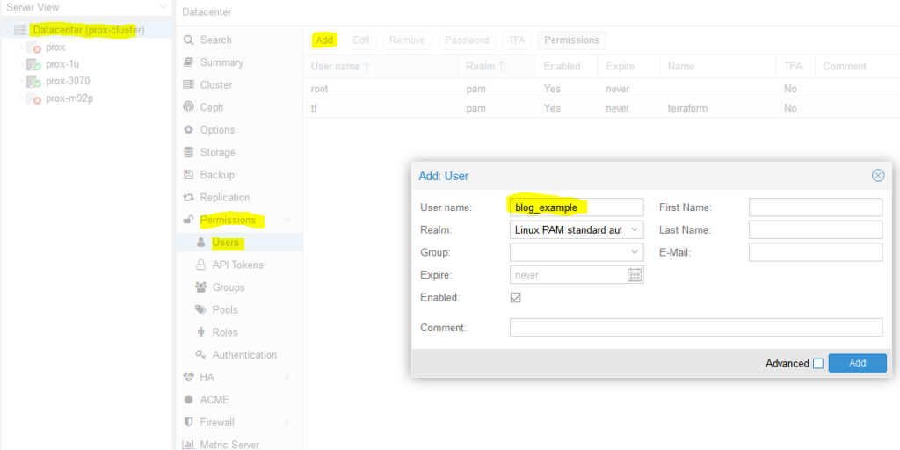
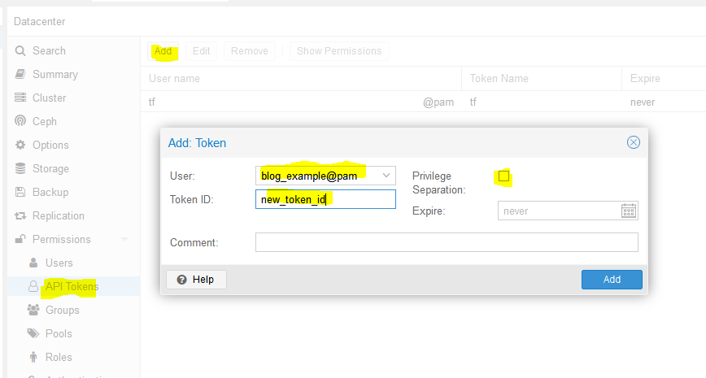

# How to deploy VMs in Proxmox with Terraform

## Background

I’d like to learn Kubernetes and DevOps. A Kubernetes cluster requires at least 3 VMs/bare metal machines. In my last post, I wrote about [how to create a Ubuntu cloud-init template for Proxmox](https://austinsnerdythings.com/2021/08/30/how-to-create-a-proxmox-ubuntu-cloud-init-image/). In this post, we’ll take that template and use it to deploy a couple VMs via automation using Terraform. If you don’t have a template, you need one before proceeding.

## Overview

1. Install Terraform
2. Determine authentication method for Terraform to interact with Proxmox (user/pass vs API keys)
3. Terraform basic initialization and provider installation
4. Develop Terraform plan
5. Terraform plan
6. Run Terraform plan and watch the VMs appear!

## Install Terraform

``` bash
curl -fsSL https://apt.releases.hashicorp.com/gpg | sudo apt-key add -
sudo apt-add-repository "deb [arch=$(dpkg --print-architecture)] https://apt.releases.hashicorp.com $(lsb_release -cs) main"
sudo apt update
sudo apt install terraform
```

### Determine Authentication Method (use API keys)

You have two options here:

- **Username/password** – you can use the existing default root user and root password here to make things easy… or
- **API keys** – this involves setting up a new user, giving that new user the required permissions, and then setting up API keys so that user doesn’t have to type in a password to perform actions

I went with the API key method since it is not desirable to have your root password sitting in Terraform files (even as an environment variable isn’t a great idea). I didn’t really know what I was doing and I basically gave the new user full admin permissions anyways. Should I lock it down? Surely. Do I know what the minimum required permissions are to do so? Nope. If someone in the comments or on Reddit could enlighten me, I’d really appreciate it!

So we need to create a new user. We’ll name it ‘blog_example’. To add a new user go to Datacenter in the left tab, then Permissions -> Users -> Click add, name the user and click add.


`Adding ‘blog_example’ user to my proxmox datacenter (cluster)`

Next, we need to add API tokens. Click API tokens below users in the permissions category and click add. Select the user you just created and give the token an ID, and uncheck privilege separation (which means we want the token to have the same permissions as the user):


`Adding a new API token for user ‘blog_example’`

**When you click Add it will show you the key. Save this key. It will never be displayed again!**


`Super secret API key secret`

Next we need to add a role to the new user. Permissions -> Add -> Path = ‘/’, User is the one you just made, role = ‘PVEVMAdmin’. This gives the user (and associated API token!) rights to all nodes (the / for path) to do VMAdmin activities:


You also need to add permissions to the storage used by the VMs you want to deploy (both from and to), for me this is /storage/local-zfs (might be /storage/local-lvm for you). Add that too in the path section. Use Admin for the role here because the user also needs the ability to allocate space in the datastore (you could use PVEVMAdmin + a datastore role but I haven’t dove into which one yet):


At this point we are done with the permissions:


### Terraform basic information and provider installation

Terraform has three main stages: init, plan, and apply. We will start with describing the plans, which can be thought of a a type of configuration file for what you want to do. Plans are files stored in directories. Make a new directory (terraform-blog), and create two files: main.tf and vars.tf:

``` bash
cd ~
mkdir terraform-blog && cd terraform-blog
touch main.tf vars.tf
```

The two files are hopefully reasonably named. The main content will be in main.tf and we will put a few variables in vars.tf. Everything could go in main.tf but it is a good practice to start splitting things out early. I actually don’t have as much in vars.tf as I should but we all gotta start somewhere

Ok so in main.tf let’s add the bare minimum. We need to tell Terraform to use a provider, which is the term they use for the connector to the entity Terraform will be interacting with. Since we are using Proxmox, we need to use a Proxmox provider. This is actually super easy – we just need to specify the name and version and Terraform goes out and grabs it from github and installs it. I used the [Telmate Proxmox provider](https://github.com/Telmate/terraform-provider-proxmox).

main.tf:

``` json
terraform {
  required_providers {
    proxmox = {
      source = "telmate/proxmox"
      version = "2.7.4"
    }
  }
}
```

Save the file. Now we’ll initialize Terraform with our barebones plan (terraform init), which will force it to go out and grab the provider. If all goes well, we will be informed that the provider was installed and that Terraform has been initialized. Terraform is also really nice in that it tells you the next step towards the bottom of the output (“try running ‘terraform plan’ next”).

``` text
austin@EARTH:/mnt/c/Users/Austin/terraform-blog$ terraform init

Initializing the backend...

Initializing provider plugins...
- Finding telmate/proxmox versions matching "2.7.4"...
- Installing telmate/proxmox v2.7.4...
- Installed telmate/proxmox v2.7.4 (self-signed, key ID A9EBBE091B35AFCE)

Partner and community providers are signed by their developers.
If you'd like to know more about provider signing, you can read about it here:
https://www.terraform.io/docs/cli/plugins/signing.html

Terraform has created a lock file .terraform.lock.hcl to record the provider
selections it made above. Include this file in your version control repository
so that Terraform can guarantee to make the same selections by default when
you run "terraform init" in the future.

Terraform has been successfully initialized!

You may now begin working with Terraform. Try running "terraform plan" to see
any changes that are required for your infrastructure. All Terraform commands
should now work.

If you ever set or change modules or backend configuration for Terraform,
rerun this command to reinitialize your working directory. If you forget, other
commands will detect it and remind you to do so if necessary.
```

### Develop Terraform plan

Alright with the provider installed, it is time to use it to deploy a VM. We will use the template as below. Alter your main.tf file to be the following. I break it down inside the file with comments

``` json
terraform {
  required_providers {
    proxmox = {
      source = "telmate/proxmox"
      version = "2.7.4"
    }
  }
}

provider "proxmox" {
  # url is the hostname (FQDN if you have one) for the proxmox host you'd like to connect to to issue the commands. my proxmox host is 'prox-1u'. Add /api2/json at the end for the API
  pm_api_url = "https://prox-1u:8006/api2/json"

  # api token id is in the form of: <username>@pam!<tokenId>
  pm_api_token_id = "blog_example@pam!new_token_id"

  # this is the full secret wrapped in quotes. don't worry, I've already deleted this from my proxmox cluster by the time you read this post
  pm_api_token_secret = "9ec8e608-d834-4ce5-91d2-15dd59f9a8c1"

  # leave tls_insecure set to true unless you have your proxmox SSL certificate situation fully sorted out (if you do, you will know)
  pm_tls_insecure = true
}

# resource is formatted to be "[type]" "[entity_name]" so in this case
# we are looking to create a proxmox_vm_qemu entity named test_server
resource "proxmox_vm_qemu" "test_server" {
  count = 1 # just want 1 for now, set to 0 and apply to destroy VM
  name = "test-vm-${count.index + 1}" #count.index starts at 0, so + 1 means this VM will be named test-vm-1 in proxmox

  # this now reaches out to the vars file. I could've also used this var above in the pm_api_url setting but wanted to spell it out up there. target_node is different than api_url. target_node is which node hosts the template and thus also which node will host the new VM. it can be different than the host you use to communicate with the API. the variable contains the contents "prox-1u"
  target_node = var.proxmox_host

  # another variable with contents "ubuntu-2004-cloudinit-template"
  clone = var.template_name

  # basic VM settings here. agent refers to guest agent
  agent = 1
  os_type = "cloud-init"
  cores = 2
  sockets = 1
  cpu = "host"
  memory = 2048
  scsihw = "virtio-scsi-pci"
  bootdisk = "scsi0"

  disk {
    slot = 0
    # set disk size here. leave it small for testing because expanding the disk takes time.
    size = "10G"
    type = "scsi"
    storage = "local-zfs"
    iothread = 1
  }

  # if you want two NICs, just copy this whole network section and duplicate it
  network {
    model = "virtio"
    bridge = "vmbr0"
  }

  # not sure exactly what this is for. presumably something about MAC addresses and ignore network changes during the life of the VM
  lifecycle {
    ignore_changes = [
      network,
    ]
  }

  # the ${count.index + 1} thing appends text to the end of the ip address
  # in this case, since we are only adding a single VM, the IP will
  # be 10.98.1.91 since count.index starts at 0. this is how you can create
  # multiple VMs and have an IP assigned to each (.91, .92, .93, etc.)

  ipconfig0 = "ip=10.98.1.9${count.index + 1}/24,gw=10.98.1.1"

  # sshkeys set using variables. the variable contains the text of the key.
  sshkeys = <<EOF
  ${var.ssh_key}
  EOF
}
```

There is a good amount going on in here. Hopefully the embedded comments explain everything. If not, let me know in the comments or on Reddit (u/Nerdy-Austin).

Now for the vars.tf file. This is a bit easier to understand. Just declare a variable, give it a name, and a default value. That’s all I know at this point and it works.

``` json
variable "ssh_key" {
  default = "ssh-rsa AAAAB3NzaC1yc2EAAAADAQABAAABAQDcwZAOfqf6E6p8IkrurF2vR3NccPbMlXFPaFe2+Eh/8QnQCJVTL6PKduXjXynuLziC9cubXIDzQA+4OpFYUV2u0fAkXLOXRIwgEmOrnsGAqJTqIsMC3XwGRhR9M84c4XPAX5sYpOsvZX/qwFE95GAdExCUkS3H39rpmSCnZG9AY4nPsVRlIIDP+/6YSy9KWp2YVYe5bDaMKRtwKSq3EOUhl3Mm8Ykzd35Z0Cysgm2hR2poN+EB7GD67fyi+6ohpdJHVhinHi7cQI4DUp+37nVZG4ofYFL9yRdULlHcFa9MocESvFVlVW0FCvwFKXDty6askpg9yf4FnM0OSbhgqXzD austin@EARTH"
}

variable "proxmox_host" {
    default = "prox-1u"
}

variable "template_name" {
    default = "ubuntu-2004-cloudinit-template"
}
```

### Terraform plan (official term for “what will Terraform do next”)

Now with the .tf files completed, we can run the plan (terraform plan). We defined a count=1 resource, so we would expect Terraform to create a single VM. Let’s have Terraform run through the plan and tell us what it intends to do. It tells us a lot.

``` terraform

austin@EARTH:/mnt/c/Users/Austin/terraform-blog$ terraform plan

Terraform used the selected providers to generate the following execution plan. Resource actions
are indicated with the following symbols:
  + create

Terraform will perform the following actions:

  # proxmox_vm_qemu.test_server[0] will be created
  + resource "proxmox_vm_qemu" "test_server" {
      + additional_wait           = 15
      + agent                     = 1
      + balloon                   = 0
      + bios                      = "seabios"
      + boot                      = "cdn"
      + bootdisk                  = "scsi0"
      + clone                     = "ubuntu-2004-cloudinit-template"
      + clone_wait                = 15
      + cores                     = 2
      + cpu                       = "host"
      + default_ipv4_address      = (known after apply)
      + define_connection_info    = true
      + force_create              = false
      + full_clone                = true
      + guest_agent_ready_timeout = 600
      + hotplug                   = "network,disk,usb"
      + id                        = (known after apply)
      + ipconfig0                 = "ip=10.98.1.91/24,gw=10.98.1.1"
      + kvm                       = true
      + memory                    = 2048
      + name                      = "test-vm-1"
      + nameserver                = (known after apply)
      + numa                      = false
      + onboot                    = true
      + os_type                   = "cloud-init"
      + preprovision              = true
      + reboot_required           = (known after apply)
      + scsihw                    = "virtio-scsi-pci"
      + searchdomain              = (known after apply)
      + sockets                   = 1
      + ssh_host                  = (known after apply)
      + ssh_port                  = (known after apply)
      + sshkeys                   = <<-EOT
              ssh-rsa AAAAB3NzaC1yc2EAAAADAQABAAABAQDcwZAOfqf6E6p8IkrurF2vR3NccPbMlXFPaFe2+Eh/8QnQCJVTL6PKduXjXynuLziC9cubXIDzQA+4OpFYUV2u0fAkXLOXRIwgEmOrnsGAqJTqIsMC3XwGRhR9M84c4XPAX5sYpOsvZX/qwFE95GAdExCUkS3H39rpmSCnZG9AY4nPsVRlIIDP+/6YSy9KWp2YVYe5bDaMKRtwKSq3EOUhl3Mm8Ykzd35Z0Cysgm2hR2poN+EB7GD67fyi+6ohpdJHVhinHi7cQI4DUp+37nVZG4ofYFL9yRdULlHcFa9MocESvFVlVW0FCvwFKXDty6askpg9yf4FnM0OSbhgqXzD austin@EARTH
        EOT
      + target_node               = "prox-1u"
      + unused_disk               = (known after apply)
      + vcpus                     = 0
      + vlan                      = -1
      + vmid                      = (known after apply)

      + disk {
          + backup       = 0
          + cache        = "none"
          + file         = (known after apply)
          + format       = (known after apply)
          + iothread     = 1
          + mbps         = 0
          + mbps_rd      = 0
          + mbps_rd_max  = 0
          + mbps_wr      = 0
          + mbps_wr_max  = 0
          + media        = (known after apply)
          + replicate    = 0
          + size         = "10G"
          + slot         = 0
          + ssd          = 0
          + storage      = "local-zfs"
          + storage_type = (known after apply)
          + type         = "scsi"
          + volume       = (known after apply)
        }

      + network {
          + bridge    = "vmbr0"
          + firewall  = false
          + link_down = false
          + macaddr   = (known after apply)
          + model     = "virtio"
          + queues    = (known after apply)
          + rate      = (known after apply)
          + tag       = -1
        }
    }

Plan: 1 to add, 0 to change, 0 to destroy.

────────────────────────────────────────────────────────────────────────────────────────────────

Note: You didn't use the -out option to save this plan, so Terraform can't guarantee to take
exactly these actions if you run "terraform apply" now.
```

You can see the output of the planning phase of Terraform. It is telling us it will create proxmox_vm_qemu.test_server[0] with a list of parameters. You can double-check the IP address here, as well as the rest of the basic settings. At the bottom is the summary – “Plan: 1 to add, 0 to change, 0 to destroy.” Also note that it tells us again what step to run next – “terraform apply”.

### Execute the Terraform plan and watch the VMs appear!

With the summary stating what we want, we can now apply the plan (terraform apply). **Note that it prompts you to type in ‘yes’ to apply the changes after it determines what the changes are**. It typically takes 1m15s +/- 15s for my VMs to get created.

If all goes well, you will be informed that 1 resource was added!


Command and full output:

``` terraform
austin@EARTH:/mnt/c/Users/Austin/terraform-blog$ terraform apply

Terraform used the selected providers to generate the following execution plan. Resource actions are indicated with the following symbols:
  + create

Terraform will perform the following actions:

  # proxmox_vm_qemu.test_server[0] will be created
  + resource "proxmox_vm_qemu" "test_server" {
      + additional_wait           = 15
      + agent                     = 1
      + balloon                   = 0
      + bios                      = "seabios"
      + boot                      = "cdn"
      + bootdisk                  = "scsi0"
      + clone                     = "ubuntu-2004-cloudinit-template"
      + clone_wait                = 15
      + cores                     = 2
      + cpu                       = "host"
      + default_ipv4_address      = (known after apply)
      + define_connection_info    = true
      + force_create              = false
      + full_clone                = true
      + guest_agent_ready_timeout = 600
      + hotplug                   = "network,disk,usb"
      + id                        = (known after apply)
      + ipconfig0                 = "ip=10.98.1.91/24,gw=10.98.1.1"
      + kvm                       = true
      + memory                    = 2048
      + name                      = "test-vm-1"
      + nameserver                = (known after apply)
      + numa                      = false
      + onboot                    = true
      + os_type                   = "cloud-init"
      + preprovision              = true
      + reboot_required           = (known after apply)
      + scsihw                    = "virtio-scsi-pci"
      + searchdomain              = (known after apply)
      + sockets                   = 1
      + ssh_host                  = (known after apply)
      + ssh_port                  = (known after apply)
      + sshkeys                   = <<-EOT
              ssh-rsa AAAAB3NzaC1yc2EAAAADAQABAAABAQDcwZAOfqf6E6p8IkrurF2vR3NccPbMlXFPaFe2+Eh/8QnQCJVTL6PKduXjXynuLziC9cubXIDzQA+4OpFYUV2u0fAkXLOXRIwgEmOrnsGAqJTqIsMC3XwGRhR9M84c4XPAX5sYpOsvZX/qwFE95GAdExCUkS3H39rpmSCnZG9AY4nPsVRlIIDP+/6YSy9KWp2YVYe5bDaMKRtwKSq3EOUhl3Mm8Ykzd35Z0Cysgm2hR2poN+EB7GD67fyi+6ohpdJHVhinHi7cQI4DUp+37nVZG4ofYFL9yRdULlHcFa9MocESvFVlVW0FCvwFKXDty6askpg9yf4FnM0OSbhgqXzD austin@EARTH
        EOT
      + target_node               = "prox-1u"
      + unused_disk               = (known after apply)
      + vcpus                     = 0
      + vlan                      = -1
      + vmid                      = (known after apply)

      + disk {
          + backup       = 0
          + cache        = "none"
          + file         = (known after apply)
          + format       = (known after apply)
          + iothread     = 1
          + mbps         = 0
          + mbps_rd      = 0
          + mbps_rd_max  = 0
          + mbps_wr      = 0
          + mbps_wr_max  = 0
          + media        = (known after apply)
          + replicate    = 0
          + size         = "10G"
          + slot         = 0
          + ssd          = 0
          + storage      = "local-zfs"
          + storage_type = (known after apply)
          + type         = "scsi"
          + volume       = (known after apply)
        }

      + network {
          + bridge    = "vmbr0"
          + firewall  = false
          + link_down = false
          + macaddr   = (known after apply)
          + model     = "virtio"
          + queues    = (known after apply)
          + rate      = (known after apply)
          + tag       = -1
        }
    }

Plan: 1 to add, 0 to change, 0 to destroy.

Do you want to perform these actions?
  Terraform will perform the actions described above.
  Only 'yes' will be accepted to approve.

  Enter a value: yes

proxmox_vm_qemu.test_server[0]: Creating...
proxmox_vm_qemu.test_server[0]: Still creating... [10s elapsed]
proxmox_vm_qemu.test_server[0]: Still creating... [20s elapsed]
proxmox_vm_qemu.test_server[0]: Still creating... [30s elapsed]
proxmox_vm_qemu.test_server[0]: Still creating... [40s elapsed]
proxmox_vm_qemu.test_server[0]: Still creating... [50s elapsed]
proxmox_vm_qemu.test_server[0]: Still creating... [1m0s elapsed]
proxmox_vm_qemu.test_server[0]: Creation complete after 1m9s [id=prox-1u/qemu/142]

Apply complete! Resources: 1 added, 0 changed, 0 destroyed.
```

Now go check Proxmox and see if your VM was created:


Success! You should now be able to SSH into the new VM with the key you already provided **(note: the username will be ‘ubuntu’, not whatever you had set in your key)**.

### Removing the test VM

I just set the count to 0 for the resource in the main.tf file and apply and the VM is stopped and destroyed.

``` terraform
resource "proxmox_vm_qemu" "test_server" {
    count = # just want 1 for now, set to 0 and apply to destroy
}
```

## Conclusion

This felt like a quick-n-dirty tutorial for how to use Terraform to deploy virtual machines in Proxmox but looking back, there is a decent amount of detail. It took me quite a while to work through permission issues, hostnames being invalid (turns out you can’t have underscores (_) in hostnames, duh, that took an hour to find), assigning roles to users vs the associated API keys, etc. but I’m glad I worked through everything and can pass it along. Check back soon for my next post on [using Terraform to deploy a full set of Kubernetes machines to a Proxmox cluster](https://austinsnerdythings.com/2021/09/23/deploying-kubernetes-vms-in-proxmox-with-terraform/) (and thrilling sequel to that post, Using Ansible to bootstrap a Kubernetes Cluster)!

## References
- https://austinsnerdythings.com/2021/09/01/how-to-deploy-vms-in-proxmox-with-terraform/
- https://registry.terraform.io/providers/Telmate/proxmox/latest/docs
- https://vectops.com/2020/05/provision-proxmox-vms-with-terraform-quick-and-easy/
- https://norocketscience.at/provision-proxmox-virtual-machines-with-terraform/
