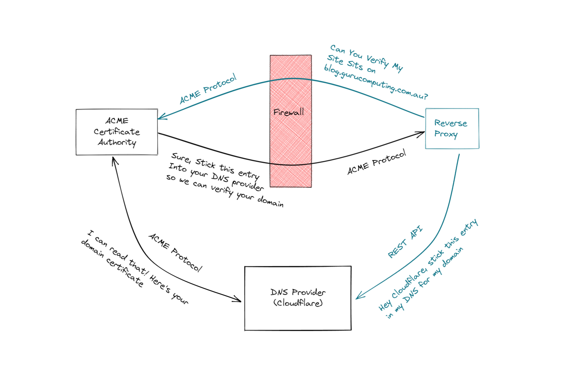

# :simple-caddy: What is Caddy?
At the most basic level, a web server like nginx or httpd. Like other web servers, caddy can serve content, or it can intercept web traffic to serve other sites (this is the core feature of a reverse proxy).at the most basic level, a web server like nginx or httpd. Like other web servers, caddy can serve content, or it can intercept web traffic to serve other sites (this is the core feature of a reverse proxy).

Unlike other web servers, caddy has some nice features that make it more palatable as a host:

-    Automatic SSL, whether you want to generate your own certs or use ACME servers
-    Very simple syntax for writing our configs. Most sites require a single directive.
-    Based on go, a modern language with memory safety controls
-    Sane defaults. By default caddy sets up sites securely and (usually) without any additional configuration
-    A single, static binary. While our implementation will be docker focused, nothing is stopping you from installing caddy as a normal package or even as an executable on Windows.

## Caddy config file
"Caddyfile" on which caddy calls the config for use. The [syntac](https://caddyserver.com/docs/caddyfile) for more details for read up.

!!! note ""
    For inside, you can refer as [offocial documentation](https://caddyserver.com/docs/)

### Example
```json
<subdomain>.<domain> {
    reverse_proxy <IP>:<Port>
}
```

## ACME Portocol
How can we get a valid HTTPS certificate, signed by a certificate authority, so our site looks valid? Well we can do it the boring manual way, generating a Certificate Signing Request (CSR), having an authority sign that request, and returning a signed certificate. No thanks.

Instead, the good people at let’s encrypt developed the ACME protocol: a completely automated way to generate and provide signed certificates to sites like yours or mine. Let’s encrypt (and other services like zeroSSL) even provide a completely free service to do this for us!

The two most widely used options are the DNS and HTTP challenge methods.

## DNS ACME Challenges


Pre-requisites:

* A Public DNS Domain, registered with a Domain Register. [cloudflare](https://www.cloudflare.com/) is the recommendation.
* [DNS provider](https://github.com/caddy-dns/cloudflare) to be available from the list of providers found in the [dns.providers modules](https://github.com/caddy-dns/cloudflare).

## Setup with Docker service
-   Create the <span class="jade">docker-compose.yml</span> in the folder named as <span class="rouge">caddy</space>.

```yaml
version: "3.9"

services:

  caddy:
    image: caddy:latest
    container_name: caddy
    hostname: caddy
    restart: unless-stopped
    security_opt:
      - label:disable
    ports:
      - "80:80"
      - "443:443"
      - "443:443/udp"
    volumes:
      - ./container-config:/etc/caddy
      - /etc/localtime:/etc/localtime:ro
```

-   Bring it up with following way:
```bash
$ docker compose up -d
```
