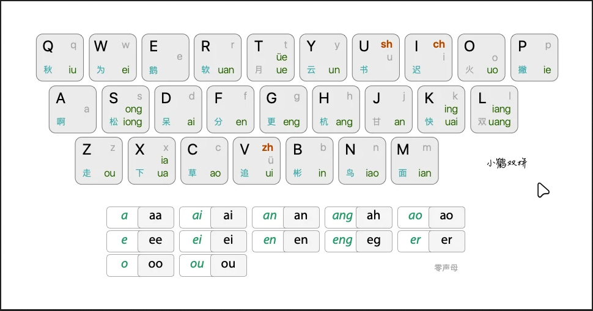

# iBus

[IBus](https://wiki.archlinux.org/title/IBus) (Intelligent Input Bus) is an input method framework, a type of application that allows for easily switching between different keyboard layouts. When combined with an input method editor, it also allows for typing non-Latin characters using a keyboard that does not natively support them.



## Installation

``` bash
paru/yay ibus-rime
paru/yay rime-double-pinyin
```

!!! NOTE "environment (optional)"
    ``` bash
    # /etc/environment
      GTK_IM_MODULE=ibus
      QT_IM_MODULE=ibus
      XMODIFIERS=@im=ibus
    ```

## Rime

Create the file of `"default.custom.yaml"` in the $HOME/.config/ibus/rime.

``` yaml
# default.custom.yaml
# save it to:
#   ~/.config/ibus/rime  (linux)
#   ~/Library/Rime       (macos)
#   %APPDATA%\Rime       (windows)

patch:
  schema_list:
    - schema: luna_pinyin          # 朙月拼音
    - schema: luna_pinyin_simp     # 朙月拼音 简化字模式
    - schema: double_pinyin_flypy  # 小鶴雙拼
    - schema: emoji                # emoji 表情
```

## Wizard Configuration

``` bash
Ctrol+`
```

## AutoStart

To launch IBus on user login, create an [autostart](https://wiki.archlinux.org/title/Autostart) entry with the following method:
!!! INFO "profile"
    ``` bash
    # /etc/profile.d
    cat /etc/profile.d/ibus.sh << EOF
    ibus-daemon -drxR
    EOF
    ```
